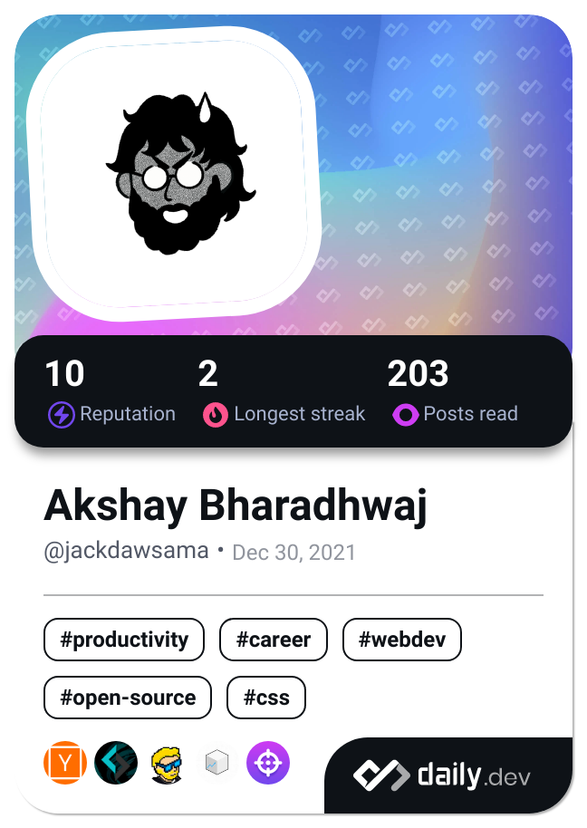

# Hey! Look! Listen!
## I'm Akshay Bharadhwaj.
## A Gamer. A Designer. A Game Designer.
Here's a bit about myself, I love video games and I love learning new skills. I recently tried to BMX and lost two teeth, so I decided to stick to what I do best which is building games and experiences. I code, I do pixel art and graphic design, build levels and design systems.
Jack of All Trades isn't exacly how I'd like to describe myself but that's the closest to what I can be called. Currently, I'm trying to pick up Shaders/HLSL because you can do cool and fun things with it and I want to do cool and fun things!

